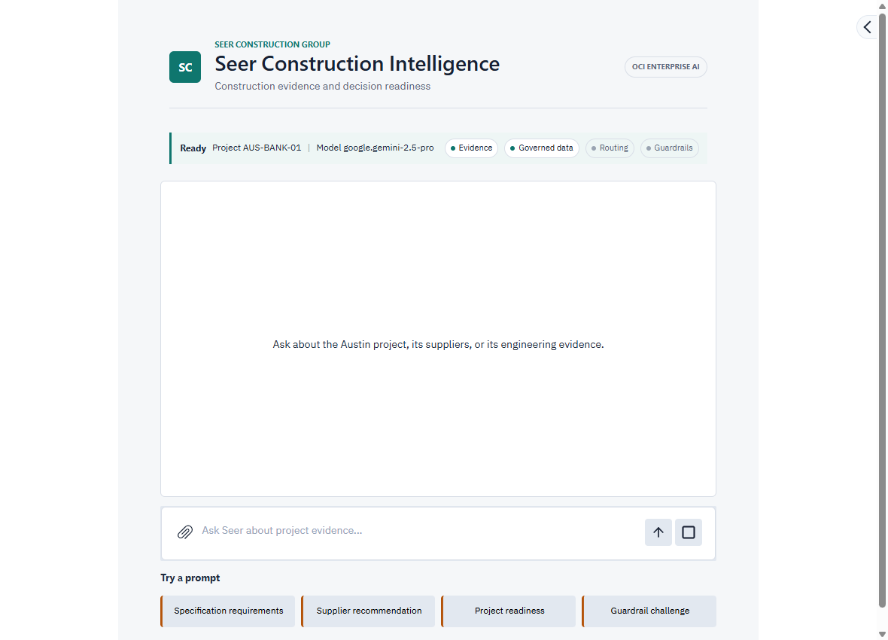
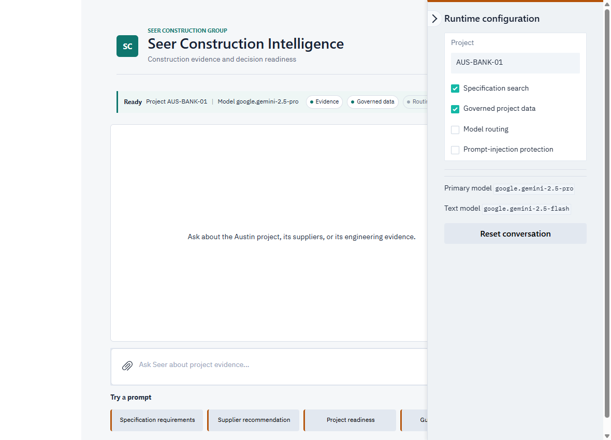

# Lab 3B: Launch the Sample Application

## Introduction

In this path, you launch the pre-built Seer Construction Intelligence application on OCI Container Instances. You connect the project and both vector stores created in Labs 1 and 2, while OCI supplies short-lived resource-principal credentials to the running container. No API key, private key, or auth token is stored in the image.

Choose either Lab 3A or Lab 3B. Both paths use the same OCI Enterprise AI capabilities and continue to Labs 4 through 6.

Estimated Time: 15 minutes

### Objectives

- Review managed deployment options for OCI Enterprise AI applications
- Launch the pre-built application with the generated helper
- Confirm specification search and governed construction-data retrieval
- Verify application health and resource-principal authentication

### Prerequisites

- The OCI Enterprise AI project OCID from Lab 1
- The completed unstructured vector store ID from Lab 1 (starts with `vs_`)
- The active semantic store OCID from Lab 2
- The **Launch helper PAR** from the Sandbox Resource List

## Task 1: Review the deployment choice

OCI Generative AI hosted applications are the managed production option for packaging, deploying, and operating agentic applications close to the service. The shared workshop tenancies have a service limit of 50 hosted applications, so they cannot allocate one hosted application to every participant at event scale. Customer tenancies are not constrained by this workshop allocation model and can request limits appropriate for their deployment.

This workshop uses OCI Container Instances to preserve the important architecture: an OCI-hosted application, resource-principal authentication, OCI Enterprise AI tools, and no long-lived credentials in the image. The public OCIR repository contains application code only. Terraform injects the pre-created database, Vault, region, image, subnet, and sizing values into the generated helper.

## Task 2: Confirm readiness

1. Confirm that the construction evidence data sync job is **Succeeded**, the unstructured vector store is **Completed**, and the processed file count is greater than zero.

2. Confirm that `seer-construction-semantic` is **Active** and semantic enrichment completed successfully.

3. Keep the project OCID, unstructured vector store ID, and semantic store OCID available. These are the only values the helper asks you to enter.

4. Confirm that the LiveLabs public subnet security list permits inbound TCP traffic on port `8080`. The workshop uses the subnet security list; it does not require a network security group.

## Task 3: Download and inspect the generated helper

1. Open Cloud Shell in the workshop region.

2. Copy the **Launch helper PAR** from the Sandbox Resource List and run the following commands. Replace `<launch-helper-par>` with the complete URL.

    ```bash
    <copy>
    curl -fL '<launch-helper-par>' -o launch-container-instance.sh
    chmod 700 launch-container-instance.sh
    </copy>
    ```

3. Inspect the pre-populated configuration.

    ```bash
    <copy>
    sed -n '1,55p' launch-container-instance.sh
    </copy>
    ```

    The compartment, public subnet, Construction Engineering database and Vault secret, region, public OCIR image URL, port `8080`, and resource sizing come from Terraform. The script does not contain an OCI user credential.

## Task 4: Launch Seer Construction Intelligence

1. Run the helper.

    ```bash
    <copy>
    ./launch-container-instance.sh
    </copy>
    ```

2. Paste the project OCID, unstructured vector store ID, and semantic store OCID when prompted.

3. Wait for the Container Instance to reach **ACTIVE**. The helper prints the Container Instance OCID and application URL.

    The instance uses 1 OCPU and 4 GB of memory. `OCI_AUTH_MODE=resource_principal` tells the OCI SDK and OCI Generative AI authentication helper to use credentials injected and rotated by OCI.

## Task 5: Validate the application

1. Open the application URL. If the page is not ready immediately, wait 30 seconds and refresh. The Gradio application responds on port `8080`.

    

2. Select **Specification requirements** under **Try a prompt**, then submit the inserted prompt.

3. Confirm that the answer is grounded in the ingested Austin structural engineering specification.

4. Select **Supplier recommendation**, then submit the inserted prompt.

5. Confirm that the answer uses the governed semantic-store and ADB MCP path and identifies supporting evidence rather than inventing approvals.

6. Open **Runtime configuration** from the right side of the application. Confirm that **Specification search** and **Governed project data** are enabled. Keep **Model routing** and **Prompt-injection protection** disabled for the baseline.

    

If either test fails, recheck the three entered resource identifiers and the readiness states from Task 2. You do not need to replace the Container Instance to enable the capabilities in Labs 4 and 5.

You may now proceed to Lab 4. Keep the application open.

## Learn More

- [Overview of OCI Container Instances](https://docs.oracle.com/en-us/iaas/Content/container-instances/overview-of-container-instances.htm)
- [OCI Generative AI IAM-based authentication](https://docs.oracle.com/en-us/iaas/Content/generative-ai/oci-genai-auth.htm)
- [OCI Generative AI application deployment permissions](https://docs.oracle.com/en-us/iaas/Content/generative-ai/deploy-permissions.htm)

## Acknowledgements

- **Author** - Oracle LiveLabs
