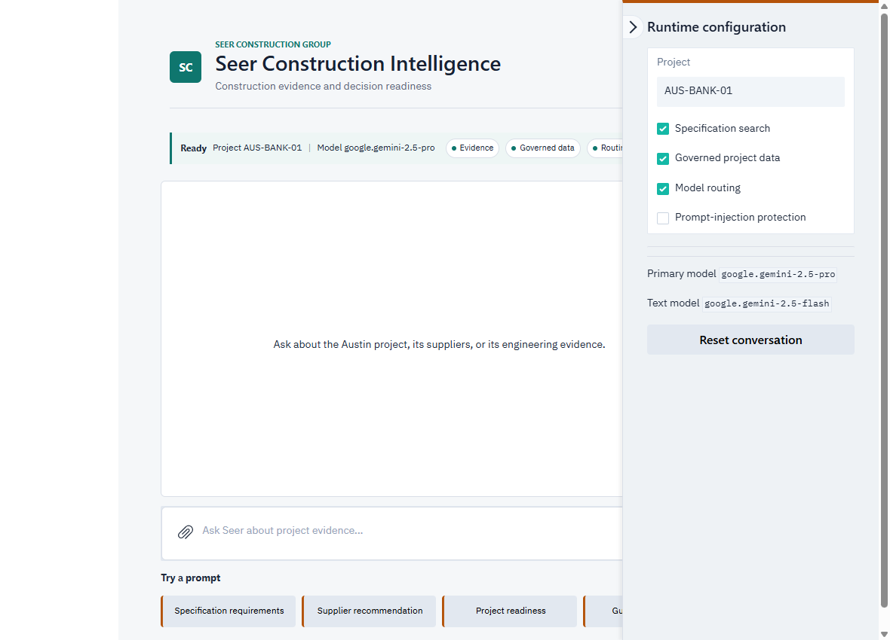

# Lab 4: Model Optimization

## Introduction

In this lab, you enable model routing in Seer Construction Intelligence. Build-path participants implement the routing decision in Python; Launch-path participants enable the equivalent capability in the running application. Text-only questions use the lower-cost model, while image prompts remain on the stronger multimodal model.

Estimated Time: 15 minutes

### Objectives

- Establish a single-model baseline
- Implement or configure a text-versus-image routing decision
- Compare text and image workloads
- Optionally evaluate another model

### Prerequisites

- A running application from Lab 3A or Lab 3B
- Access to both configured models in the workshop region

## Task 1: Record the baseline

1. Confirm that the runtime bar shows **Routing** disabled. In the Build path, also confirm that `.env` contains `OCI_GENAI_MODEL_ROUTING_ENABLED=false`.

2. Select **Supplier recommendation**, submit the prompt, and record the model shown in the runtime bar and the approximate response time.

3. Attach a nonconfidential construction image and ask the application to separate observations from assumptions. Record the selected model and approximate response time.

## Task 2: Enable model routing

### Build path: implement the routing decision

1. Stop the local application with Ctrl+C and open `llm.py` in your editor.

2. Find `response_model`. The starter always returns the primary model. Add the following decision immediately below the function definition:

    ```python
    <copy>
    if cfg.get("model_routing_enabled") and not messages_include_images(messages):
        model = cfg.get("cheaper_model") or model
    </copy>
    ```

    This sends text-only requests to the lower-cost model while preserving the multimodal model for image input.

3. In `.env`, set:

    ```text
    <copy>
    OCI_GENAI_MODEL_ROUTING_ENABLED=true
    </copy>
    ```

4. Save both files and restart the application with `python app.py`.

### Launch path: enable the packaged routing policy

1. Open **Runtime configuration** from the right side of the application.

2. Enable **Model routing**. The runtime bar immediately shows **Routing** enabled.

    

3. Close the configuration panel. The same running application and conversation remain available; no restart or replacement Container Instance is required.

## Task 3: Test the routing policy

1. Select **Supplier recommendation** and submit the prompt.

2. Confirm that the runtime bar reports the lower-cost text model for this text-only request.

3. Attach a construction image and ask for observations separated from assumptions. Confirm that the stronger multimodal model is selected.

4. Compare capability, latency, response depth, and estimated token cost with the baseline.

## Task 4: Optional additional-model experiment

1. Choose another text-capable model available in the workshop region.

2. For the Build path, set `OCI_GENAI_CHEAPER_MODEL` in `.env` and restart the local app. For the Launch path, edit the generated helper's `CHEAPER_MODEL` value and launch a separate experiment instance.

3. Run the same governed-data prompt across the candidates and record latency, evidence quality, and relative cost. Keep image input on a model that explicitly supports images.

4. Delete an experiment instance when you finish. The workshop's main Launch instance does not need to be replaced for the standard routing exercise.

You may now proceed to Lab 5.

## Learn More

- [OCI Generative AI models](https://docs.oracle.com/en-us/iaas/Content/generative-ai/pretrained-models.htm)

## Acknowledgements

- **Author** - Oracle LiveLabs
